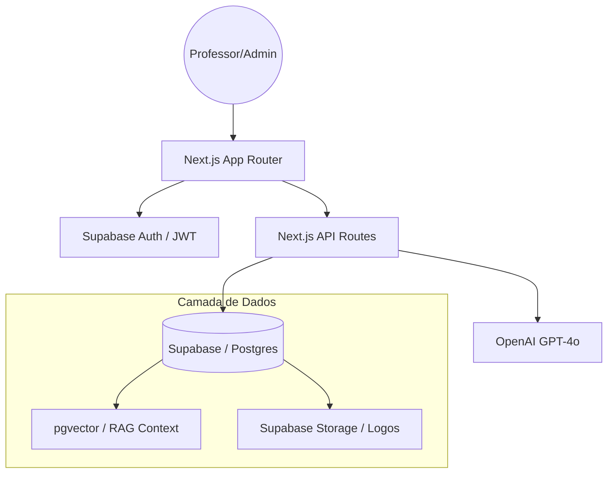

# 🍏 Examyx — Inteligência Pedagógica


**Examyx** é uma plataforma SaaS B2B projetada para transformar a produtividade docente. Através de Inteligência Artificial Generativa e busca vetorial (RAG), o Examyx permite que professores e instituições criem avaliações de alta qualidade, alinhadas à BNCC, em poucos minutos.

---

## 🚀 Principais Funcionalidades

### 🧠 Inteligência Artificial & RAG
- **Geração por Contexto**: A IA não "alucina". Ela lê seus PDFs, PPTs e documentos da escola para criar questões baseadas no material didático real.
- **Busca Semântica BNCC**: Integração profunda com a Base Nacional Comum Curricular. Encontre habilidades e competências apenas descrevendo o tema.
- **OCR de Alta Precisão**: Transforme fotos de provas antigas ou livros em questões digitais editáveis instantaneamente.

### 🏫 Modelo de Negócio B2B (Multi-tenant)
- **Gestão Institucional**: Painel administrativo para gerenciar múltiplas escolas, professores e limites de uso.
- **Identidade Visual Dinâmica**: Cada escola possui seu próprio logo e nome, que são aplicados automaticamente nos dashboards e nos PDFs gerados.
- **Controle de Tokens**: Trava de segurança server-side que impede o uso além do contratado, garantindo a sustentabilidade financeira da plataforma.

### ♿ Acessibilidade & Pedagogia
- **Níveis de Bloom**: Gere questões focadas em diferentes níveis cognitivos (Lembrar, Entender, Analisar...).
- **Suporte Inclusivo**: Opções para gerar provas adaptadas para alunos com TEA, Dislexia e TDAH.
- **Exportação Profissional**: Gere PDFs prontos para impressão com cabeçalho da escola e gabaritos comentados.

---

## 🛠️ Stack Tecnológica

- **Framework**: [Next.js 15](https://nextjs.org/) (App Router)
- **Estilização**: Tailwind CSS + Lucide Icons
- **Banco de Dados**: PostgreSQL via [Supabase](https://supabase.com/)
- **IA/LLM**: GPT-4o & GPT-4 Vision (OpenAI)
- **Vectores**: pgvector (Busca de similaridade para documentos e BNCC)
- **Segurança**: Supabase Auth (JWT + RBAC)

---

## 📐 Arquitetura do Sistema



---

## 📦 Como Instalar e Rodar

1. **Clone o repositório**:
   ```bash
   git clone https://github.com/seu-usuario/examyx.git
   ```

2. **Instale as dependências**:
   ```bash
   npm install
   ```

3. **Configure as Variáveis de Ambiente**:
   Crie um arquivo `.env.local` e adicione:
   ```env
   NEXT_PUBLIC_SUPABASE_URL=seu_url
   NEXT_PUBLIC_SUPABASE_ANON_KEY=sua_chave_anon
   SUPABASE_SERVICE_ROLE_KEY=sua_chave_service_role
   OPENAI_API_KEY=sua_chave_openai
   ```

4. **Inicie o Servidor de Desenvolvimento**:
   ```bash
   npm run dev
   ```

---

## 🔒 Segurança (RBAC)

O Examyx utiliza um sistema rígido de **Role-Based Access Control**:
- **Super Admin**: Gestão de escolas (tenants), logs de erros e controle de tokens global.
- **Teacher**: Acesso ao gerador de provas, banco de questões e materiais da sua própria instituição.

---

## 📄 Licença

Este projeto está sob a licença MIT. Veja o arquivo [LICENSE](LICENSE) para mais detalhes.

---
<p align="center">Desenvolvido IA para transformar a educação brasileira.</p>
